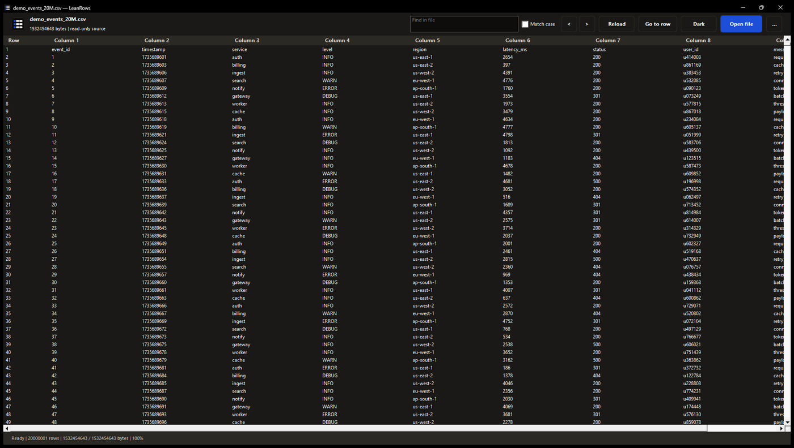

# LeanRows

**Open a 1.5 GB CSV with 20 million rows using 18 MB of RAM. No installer, no
runtime, no admin rights.**



*20,000,001 rows, 1,532,454,643 bytes, fully indexed. Peak working set: 18.4 MB.*

Excel stops at about 1.05 million rows. Most tools that go further are paid, need
an installer, or live in a terminal. LeanRows is a single 618 KB executable you
can copy onto a locked-down work machine and run.

It is strictly read-only, so it cannot alter the file it is inspecting. There is
no telemetry and no network access of any kind.

## Install

Download the portable ZIP from the
[latest release](https://github.com/abooodbah/leanrows/releases/latest), extract
it, and run `leanrows.exe`. Outside that folder, LeanRows writes only its
appearance setting, under `HKCU\Software\LeanRows`, and a scratch folder for
search results, under `%LOCALAPPDATA%\LeanRows`.

## Supported formats

CSV, TSV, JSONL, NDJSON, log, and plain text, on Windows x64. CSV and TSV record
boundaries are quote-aware across read blocks, including quoted fields containing
newlines. JSONL, NDJSON, log, and text files are treated as line-oriented records.

## How it stays small

The file is indexed progressively as you move through it, and only the rows
currently in the viewport are materialized. Peak memory is governed by window
size rather than file size, which is why the figure above stays flat whether the
source is 15 MB or 1.5 GB.

LeanRows is for viewing large row-based data files without loading everything
into memory. [LeanMark](https://github.com/abooodbah/leanmark) is for reading
Markdown documents in a clean, focused interface. Both are read-only tools
designed to make local files easier to inspect without changing them.

## Why LeanRows

- **Progressive viewing:** the first bounded viewport is prepared before the
  background index reaches the end of a large file.
- **Bounded data structures:** fixed-capacity checkpoints, viewport caches,
  previews, and coalescing worker queues prevent memory use from scaling with
  the source file by design.
- **Read-only snapshots:** LeanRows never edits, imports, or rewrites the source.
- **Focused inspection tools:** inline literal search, absolute-row navigation,
  and bounded clipboard copy operate without constructing a whole-file model.
- **Native Windows interface:** a responsive command bar and virtual owner-data
  grid use Win32 controls rather than a browser engine or bundled web runtime.
- **Local operation:** the application contains no telemetry, update checker,
  account system, or network retrieval path.
- **Visible malformed data:** invalid bytes are escaped and oversized values are
  marked as truncated instead of being silently normalized.

## Download

The official package is attached to the
[GitHub release](https://github.com/abooodbah/leanrows/releases/latest) as:

```text
LeanRows-v0.2.0-windows-x64-unsigned.zip
LeanRows-v0.2.0-windows-x64-unsigned.sha256
```

LeanRows 0.2 is not Authenticode-signed. Windows may therefore show a security
warning. Verify the downloaded ZIP before running it:

```powershell
Get-FileHash .\LeanRows-v0.2.0-windows-x64-unsigned.zip -Algorithm SHA256
```

The result must match the value in the accompanying `.sha256` file from the
same release.

## Run or install

The extracted ZIP is portable. Launch `leanrows.exe` directly, pass one or more
supported file paths on the command line, use **Open file** or `Ctrl+O`, or drop
supported files onto the window. Each file opens in its own tab.

While LeanRows is running, a file opened from Explorer or the command line joins
the running window as a new tab, so every open file shares one process. A copy
started from a different folder, such as a portable copy next to an installed
one, keeps its own window.

An optional per-user installation is also included:

```powershell
.\install.ps1 -ValidateOnly
.\install.ps1
```

`-ValidateOnly` checks the package manifest and file hashes without changing
files or the registry. Installation places LeanRows under
`%LOCALAPPDATA%\Programs\LeanRows` and registers it as an available handler for
`.csv`, `.tsv`, `.jsonl`, `.ndjson`, and `.log`. Where an extension has no
protected Explorer `UserChoice`, the installer records its prior direct
per-user default and makes LeanRows the direct per-user default. Protected
choices and `.txt` remain untouched. The installer also adds LeanRows to the
current user's Start menu and Installed Apps list.

Run the installed uninstaller with:

```powershell
& "$env:LOCALAPPDATA\Programs\LeanRows\uninstall.ps1"
```

See the [installer contract](installer/README.md) for the exact package and
registry behavior.

## Supported input

| Format | Extensions | v0.2 behavior |
| --- | --- | --- |
| Comma-separated data | `.csv` | Quote-aware logical records in independently bounded native columns |
| Tab-separated data | `.tsv` | Quote-aware logical records in independently bounded native columns |
| JSON Lines | `.jsonl`, `.ndjson` | One physical line per displayed record; no schema or JSON-tree view |
| Logs and text | `.log`, `.txt` | One physical line per displayed record |

Format selection is extension-based in 0.2. Input is treated as bytes and
decoded for display as UTF-8; invalid bytes are shown as `\xNN`. Long records,
fields, and display strings use bounded previews and are marked when truncated.

LeanRows 0.2 deliberately excludes editing, saving, export, sorting, filtering,
regular expressions, SQL, charts, archives, remote or UNC paths, reparse points,
tail/follow mode, plug-ins, scripts, and arbitrary JSON documents.

## Snapshot behavior

An open document is a read-only snapshot. On Windows, the retained file handle
allows reads and atomic replacement but does not share in-place writes. An
editor that appends to, truncates, or rewrites the same file may receive a
sharing violation while it remains open in LeanRows. Editors that save by
atomic replacement can proceed; LeanRows detects the changed path identity and
requires a reload before continuing.

This behavior prevents indexed offsets from being combined with different file
bytes. Closing the document releases the retained handle.

## Memory model

LeanRows does not load the complete document, store an offset for every row, or
create a full in-memory object model. It reads positioned blocks, maintains a
fixed-capacity adaptive index, and decodes only bounded record previews for the
active viewport. A single large record is scanned incrementally rather than
allocated as one buffer.

Literal Find uses fixed read and result-page buffers. Its result positions are
stored in an application-owned scratch file capped at 64 MiB under
`%LOCALAPPDATA%\LeanRows\query-cache`, never beside the source. Find is
demand-driven: it advances only far enough to answer the current next or
previous request. Owned scratch files are removed after use, and stale-file
recovery is coordinated across concurrent LeanRows processes.

Every open file shares one process. Each tab has its own background worker,
file handle, index, and cached row window; a tab that is not showing keeps its
rows in the same allocation its worker already holds, so switching tabs copies
nothing. At most 32 files can be open at once. A window with no open file runs
no worker thread, and minimizing the window asks Windows to page out the
process until it is used again.

These bounds apply to data-dependent application structures, not to a fixed
whole-process RAM guarantee. Executable pages, Windows controls, thread stacks,
allocator overhead, and the operating-system file cache are separate. Release
qualification records full process-tree memory independently; see
[Acceptance and assurance](docs/ACCEPTANCE.md).

## Keyboard and accessibility

- `Ctrl+O` opens the native file picker.
- `Ctrl+F` focuses the inline literal-search field. `Enter` or `F3` moves to the
  next match; `Shift+Enter` or `Shift+F3` moves to the previous stored match.
- `Ctrl+G` jumps to a checked, one-based absolute row number.
- `Ctrl+C` copies selected cached rows as tab-delimited Unicode text. One
  operation is limited to 4,096 rows and 1 MiB, including the terminator.
- `F5` reloads the active path as a new snapshot.
- `Ctrl+Tab` and `Ctrl+Shift+Tab` (or `Ctrl+PgDn` and `Ctrl+PgUp`) move between
  tabs. `Ctrl+1` to `Ctrl+8` pick a tab by position and `Ctrl+9` picks the last
  one. `Ctrl+W` or `Ctrl+F4` closes the current tab; a middle click closes any
  tab.
- Standard list navigation keys move through the virtual row control.

Find compares raw UTF-8 bytes. Its optional case-insensitive mode folds ASCII
letters only; non-ASCII bytes remain exact. Regular expressions are not
supported in 0.2.

The interface provides System, Light, and Dark appearance modes. System follows
the active Windows app theme. The application also provides per-monitor DPI
handling, visible keyboard focus, and Microsoft Active Accessibility names for
the window, grid, and row items. When Windows high contrast is active,
application colors yield to the corresponding system colors.

## Build from source

The workspace pins Rust 1.97.1:

```powershell
rustup toolchain install 1.97.1 --profile minimal --component rustfmt,clippy
cargo +1.97.1 build --release --locked -p leanrows-app
```

The release executable is written to `target/release/leanrows.exe`. Building
the Windows application requires the Windows SDK resource compiler (`rc.exe`)
because the manifest and application icon are embedded at build time.

Run the repository checks with:

```powershell
cargo +1.97.1 fmt --all -- --check
cargo +1.97.1 test --workspace --all-targets --locked
cargo +1.97.1 clippy --workspace --all-targets --locked -- -D warnings
.\scripts\Test-ReleaseEngineering.ps1
```

## Project documentation

- [Architecture](docs/ARCHITECTURE.md)
- [Acceptance and assurance](docs/ACCEPTANCE.md)
- [Validation status](docs/VALIDATION_STATUS.md)
- [LeanRows 0.2.0 release notes](docs/releases/v0.2.0.md)
- [LeanRows 0.1.3 release notes](docs/releases/v0.1.3.md)
- [LeanRows 0.1.2 release notes](docs/releases/v0.1.2.md)
- [LeanRows 0.1.1 release notes](docs/releases/v0.1.1.md)
- [Security policy](SECURITY.md)
- [Roadmap](ROADMAP.md)
- [Contributing](CONTRIBUTING.md)
- [Changelog](CHANGELOG.md)
- [Citation metadata](CITATION.cff)

## License

LeanRows is available under the [MIT License](LICENSE).
