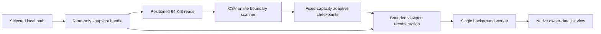

# Architecture

LeanRows is a native Windows x64 application for bounded, read-only inspection
of row-oriented local files. The source file remains the primary backing store;
the application does not import the document into a database or construct a
whole-file in-memory model.

This document describes the 0.1.2 implementation. Future candidates are kept
in the [roadmap](../ROADMAP.md) rather than presented as current behavior.

## System boundary

The release has three implementation layers:

- `leanrows-core` contains safe, platform-independent scanners, checkpoint
  indexes, cancellation, memory plans, viewport reconstruction, source
  fingerprints, and literal-query primitives.
- `leanrows-win32` owns Windows file validation, stronger file-identity checks,
  the bounded document cache, the worker, and the native interface.
- `leanrows-app` provides the executable entry point and embeds the DPI-aware
  manifest and application icon.

The production interface uses Win32 common controls. It does not embed a
browser engine, start a helper process, or use a GUI framework with a second
runtime.

The 0.1.2 shell uses warm, opaque surfaces, dark text, a single blue action
accent, and restrained one-pixel rules. Its top bar arranges file identity,
inline search, and document commands in wide, default, or narrow layouts based
on the DPI-scaled client width. Commands that do not fit remain available
through the overflow control. This responsive shell changes placement and
presentation; it does not change how document rows are owned or loaded.

## Open and snapshot semantics

The document engine accepts regular files on local Windows volumes. UNC and
remote paths, device-path syntax, reparse points, symbolic links, directories,
and other non-regular inputs are rejected before document work begins.

The application opens one retained handle with read access. On Windows, its
sharing mode permits reads and deletion but excludes writes. This prevents an
in-place append, truncate, or rewrite from changing bytes below an existing
row index. The delete share allows the common atomic-save pattern in which an
editor replaces the path with a new file.

LeanRows records evidence for both the retained handle and the selected path.
It rechecks size and revision information during bounded read steps and also
uses Windows volume, file-index, and change-time evidence. If the handle or path
no longer represents the opened snapshot, the operation stops and the document
must be reloaded. Old offsets are not used against replacement bytes.

## Record boundaries

Format selection is based on the extension:

| Extensions | Scanner | Display interpretation |
| --- | --- | --- |
| `.csv` | Comma-delimited CSV state machine | Bounded projected fields |
| `.tsv` | Tab-delimited CSV state machine | Bounded projected fields |
| `.jsonl`, `.ndjson` | Physical-line scanner | Inert line preview |
| `.log`, `.txt` | Physical-line scanner | Inert line preview |

The delimited scanner recognizes a quote only at field start, treats `""` as
an escaped quote, and permits CR, LF, or CRLF inside a quoted field. Scanner
state crosses read-block boundaries, so an embedded newline does not become a
new row merely because it occurs in another block.

JSONL and NDJSON are deliberately line-oriented in 0.1. The viewer does not
validate every line as JSON, infer a schema, or build a JSON tree. Log and text
records use the same physical-line boundary rules.

## Bounded indexing and viewport reconstruction

Sequential scans use positioned 64 KiB reads and make cancellation checks at
bounded intervals. A fixed-capacity index stores sparse `(row, byte offset)`
checkpoints. It begins with a row stride and doubles that stride when capacity
is reached, thinning older entries in place. This keeps index storage bounded
while increasing the amount of rescanning required for distant seeks as a file
grows.

A viewport starts at the closest trustworthy checkpoint, scans forward to the
requested absolute row, and materializes at most 128 records. Each raw record
preview is capped at 4 KiB. Delimited projection retains at most 64 fields,
with a 1 KiB decoded-byte bound per field and a 4 KiB decoded-row bound. Display
cells are capped at 1,024 UTF-16 code units plus a terminator.

The caps are part of the 0.1 correctness and availability contract. They do not
imply that the source value is shorter. Cache metadata records source and
display truncation, and invalid UTF-8 bytes are rendered as `\xNN` escapes.

## Worker and UI model

One background worker owns the active document engine. Open, viewport, query,
signal, and event channels have capacity one and replace obsolete pending work.
A new open increments the cancellation generation, and UI state ignores events
whose path or serial no longer matches the active document.

The first viewport is requested before the sequential index scan proceeds to
completion. Progress events are coalesced rather than posted for every read.
The UI receives immutable, reference-counted row caches and invalidates only the
affected native list view.

The owner-data `SysListView32` asks for cell text through `LVN_GETDISPINFO`.
That callback performs cache lookup only: it does not allocate, decode, lock,
read a file, or wait for the worker. A sliding absolute-row model keeps document
positions as 64-bit values while respecting the native control's finite item
range.

The top bar, progress rule, owner-data grid, empty state, and status strip are
laid out as one DPI-aware client area. Resizing selects a layout band rather
than creating another copy of the controls. The grid remains the only document
row surface in every band.

## Memory accounting

Core operations use explicit plans that account for read buffers, checkpoints,
viewport payload, operation scratch space, field projections, previews, and
query result pages before allocation. Fallible reservations return an error
instead of silently falling through to a proportional allocation.

This managed allocation model is narrower than total process RAM. Windows
controls, executable pages, thread stacks, allocator metadata, and file-cache
pages are not part of the same ledger. The release QA therefore samples the
complete process tree and reports private bytes and working set separately.
No fixed total-RAM number is claimed solely from the internal bounds.

## Query primitives

`leanrows-core` includes a cancellable literal byte-query engine with exact and
ASCII case-insensitive matching. Matches cannot cross logical record
boundaries. Result pages and application-owned scratch storage have explicit
capacity and quota contracts.

The inline search workflow submits demand-driven query commands to the same
worker. `Ctrl+F` focuses the field, `Enter` or `F3` advances until the next
result is available, and `Shift+Enter` or `Shift+F3` returns to a stored
result. Search uses a fixed 64 KiB read-through cache, 256-hit pages, and a
64 MiB scratch quota. Scratch files live below
`%LOCALAPPDATA%\LeanRows\query-cache`, not beside the source, and concurrent
processes coordinate stale-file recovery. Case-insensitive matching folds ASCII
letters only. The 0.1 query path does not implement regular expressions.

## Accessibility and rendering

The window, top-bar controls, virtual grid, and row items retain native
accessibility semantics, with bounded Microsoft Active Accessibility names
where the application supplies them. The interface exposes System and Light
appearance choices; 0.1.2 does not claim a native dark theme. When Windows high
contrast is active, application colors yield to the applicable system colors.
Keyboard focus remains visible, and per-monitor DPI changes rebuild the layout
metrics and fonts. Cached UTF-16 cells are NUL-terminated before they reach the
native control.

Displayed file content is inert text. It is not interpreted as HTML, ANSI
commands, a spreadsheet formula, a file path, a URL, or executable input.

## Network and persistence

The application contains no network retrieval, telemetry, updater, cloud
synchronization, authentication, or account flow. Viewing a document creates no
database or sidecar beside the source. Find may create a quota-limited,
application-owned scratch file below the user's local application-data
directory; normal shutdown removes it, and startup recovery is path-confined.
The optional installer writes only the documented per-user application files
and registry registrations.

## 0.1 exclusions

Editing and saving, export, type coercion, global sort, filtering, regular
expressions, SQL, joins, charts, statistics, arbitrary JSON documents, remote
sources, tail/follow, archives, compression, multiple-file merge, plug-ins,
scripts, AI features, and non-Windows releases are outside the 0.1 boundary.

See [Acceptance and assurance](ACCEPTANCE.md) for release qualification and
[architecture decisions](adr/README.md) for the rationale behind the main
constraints.
